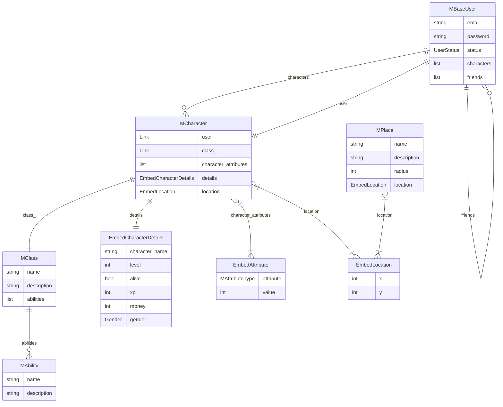

## Project setup:

### Run the following commands from the root of the project
* `make run`

### Connect to the database

```mermaid
erDiagram
    MBaseUser {
        string email
        string password
        UserStatus status
        list characters
        list friends
    }
    MCharacter {
        Link user
        Link class_
        list character_attributes
        EmbedCharacterDetails details
        EmbedLocation location
    }
    MClass {
        string name
        string description
        list abilities
    }
    MAbility {
        string name
        string description
    }
    MPlace {
        string name
        string description
        int radius
        EmbedLocation location
    }
    EmbedCharacterDetails {
        string character_name
        int level
        bool alive
        int xp
        int money
        Gender gender
    }
    EmbedAttribute {
        MAttributeType attribute
        int value
    }
    EmbedLocation {
        int x
        int y
    }

    MBaseUser ||--o{ MCharacter : "characters"
    MBaseUser ||--o{ MBaseUser : "friends"
    MCharacter ||--|| MBaseUser : "user"
    MCharacter ||--|| MClass : "class_"
    MClass ||--o{ MAbility : "abilities"
    MCharacter ||--|| EmbedCharacterDetails : "details"
    MCharacter }|--|{ EmbedAttribute : "character_attributes"
    MCharacter }|--|{ EmbedLocation : "location"
    MPlace }|--|{ EmbedLocation : "location"
```